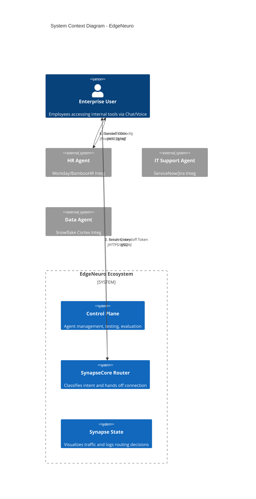
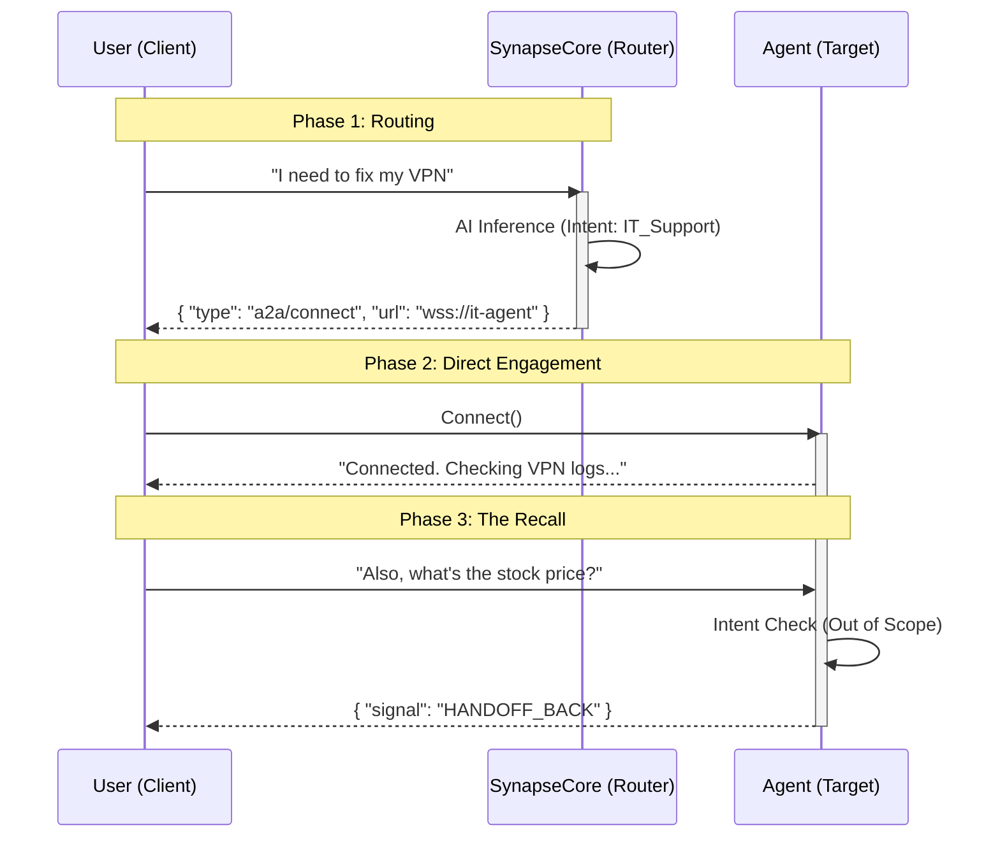

# EdgeNeuro 🧠

**Enterprise-Grade Serverless Intent Detection Router**


> "The future is per-request ephemeral supervisors that spin up, route, and die. It's efficient." — *EdgeNeuro Philosophy*

EdgeNeuro is a "Hot Potato" architecture orchestrator built on Cloudflare Workers (SynapseCore), Workers AI (Llama-3), and Durable Objects. It acts as an **Edge Router**, classifying user intent in <50ms and handing off connections directly to specialized agents.

---

## Architecture Diagrams

### System Context

EdgeNeuro acts as the intelligent routing layer (middleware) between Enterprise Users and the distributed Agent Mesh.



### The "Hot Potato" Handoff Protocol

The Router does NOT proxy traffic; it introduces and leaves. This ensures zero bottleneck and infinite scalability.



---

## Components

| Component | Description | Deployment |
|-----------|-------------|------------|
| **SynapseCore** | Router with intent detection, agent registry, MCP/A2A support | Cloudflare Workers |
| **Control Plane** | Web UI for agent management, testing, evaluation | Cloudflare Pages |
| **Test Agents** | Sample HR and IT agents for POC | Cloudflare Workers |

---

## 🧠 Neuro-Symbolic Architecture (2026)

EdgeNeuro implements a **Neuro-Symbolic** approach to access control, combining the best of neural networks and symbolic AI.

### The Principle: Default Deny (Privilege Minimal)

```
┌─────────────────────────────────────────────────────────────┐
│                    DEFAULT DENY 🚫                          │
├─────────────────────────────────────────────────────────────┤
│  User Query → Intent Detection → Policy Evaluation         │
│                              ↓                             │
│              ┌───────────────────────────────┐             │
│              │ EXPLICIT PERMISSION EXISTS?   │             │
│              └───────────────────────────────┘             │
│                    ↓              ↓                        │
│                   YES              NO                       │
│                    ↓              ↓                        │
│              [ALLOW]          [DENY 🚫]                   │
└─────────────────────────────────────────────────────────────┘
```

**Why Default Deny?**
- **Security:** If the LLM makes an error, access is blocked (not opened)
- **Predictable:** Every decision is traceable and auditable
- **No Ambiguity:** No "maybe" - explicit allow or deny

### Neuro + Symbolic: Two Layers

| Layer | Component | Purpose |
|-------|-----------|---------|
| **Neural** | LLM (Llama-3) | Detect user intent (what they want) |
| **Symbolic** | Access Policy Engine | Enforce permissions (what they CAN have) |

### How It Works

1. **User Query** → Sent to SynapseCore
2. **Neural Layer** → LLM classifies intent (e.g., "PAYROLL")
3. **Symbolic Layer** → Knowledge Graph queries permission paths
4. **Decision** → ALLOW (route to agent) or DENY (with alternatives)

### 🕸️ Knowledge Graph (Symbolic Layer)

```
    ┌──────────┐         ┌─────────┐         ┌─────────┐
    │   USER   │────────▶│   ROLE  │────────▶│ TOPIC  │
    └──────────┘         └─────────┘         └─────────┘
         │                    │                    │
         │                    │ CAN_ACCESS         │
         │                    │                    │
         │                    ▼                    │
         │              ┌─────────┐               │
         └────────────▶│PERMISSION│◀─────────────┘
                       └─────────┘
                            │
                   ┌────────┴────────┐
                   │                 │
                   ▼                 ▼
             [ALLOW]            [DENY]
```

**Knowledge Graph Features:**
- **Nodes:** USER, ROLE, GROUP, TOPIC, AGENT, RULE
- **Edges:** HAS_ROLE, CAN_ACCESS, MEMBER_OF, ROUTES_TO
- **Queryable:** Find all paths from role to topic
- **Explainable:** Every decision includes the reasoning path
- **Dynamic:** Can update permissions without code changes

### Security Model

| Concept | Implementation |
|---------|----------------|
| **Policy** | Explicit role → topic mappings in `symbolic-engine.ts` |
| **Resolution** | Topic aliases (e.g., "vacation" → "BENEFITS") |
| **Denial** | Returns alternatives user CAN access |
| **Audit** | Every decision logged with auditId |

### Example Access Policy

```typescript
const ACCESS_POLICY = {
  'PAYROLL': ['HR_ADMIN', 'FINANCE', 'CEO'],
  'BENEFITS': ['HR_ADMIN', 'HR_MANAGER', 'CEO'],
  'IT_TICKETS': ['ALL'],  // Anyone can access
  'SALES_REPORTS': ['SALES', 'MARKETING', 'CEO'],
  'HR_POLICIES': ['ALL'],  // Public
  'ADMIN_PANEL': ['ADMIN']
};
```

### API Endpoints (Symbolic)

| Endpoint | Method | Description |
|----------|--------|-------------|
| `/v1/symbolic/policy` | GET | Get access policy + Knowledge Graph stats |
| `/v1/symbolic/graph` | GET | Query Knowledge Graph directly |
| `/v1/symbolic/evaluate` | POST | Evaluate single access request |
| `/v1/symbolic/route` | GET | Full neuro-symbolic routing |

### Example: Query Knowledge Graph

```
GET /v1/symbolic/graph?role=MARKETING
```

```json
{
  "query": "accessible_topics",
  "role": "MARKETING",
  "accessible_topics": [
    { "topic": "SALES_REPORTS", "access_level": "READ", "path": "MARKETING → SALES_REPORTS" },
    { "topic": "MARKETING_CAMPAIGNS", "access_level": "READ", "path": "MARKETING → MARKETING_CAMPAIGNS" },
    { "topic": "IT_TICKETS", "access_level": "READ", "path": "EMPLOYEE → IT_TICKETS" }
  ]
}
```

### Example: Check Specific Access

```
GET /v1/symbolic/graph?role=MARKETING&topic=PAYROLL
```

```json
{
  "query": "access_check",
  "role": "MARKETING",
  "topic": "PAYROLL",
  "has_access": false,
  "explanation": "Role MARKETING does NOT have access to PAYROLL. No path found in knowledge graph.",
  "paths": []
}
```

### Example Request/Response

**Request:**
```
GET /v1/symbolic/route?q=show%20payroll%20data&role=MARKETING
```

**Response:**
```json
{
  "architecture": {
    "neural": {
      "component": "LLM Intent Detection",
      "output": { "topic": "PAYROLL", "confidence": 0.95 }
    },
    "symbolic": {
      "component": "Symbolic Access Engine", 
      "principle": "DEFAULT_DENY",
      "output": { "decision": "DENY", "reason": "Role MARKETING not in allowed roles for PAYROLL" }
    }
  },
  "allowed": false,
  "alternatives": ["SALES_REPORTS", "HR_POLICIES", "IT_TICKETS"],
  "suggestions": [
    "Your role (MARKETING) does not have access to PAYROLL",
    "You can access: SALES_REPORTS, HR_POLICIES, IT_TICKETS",
    "Contact your manager to request access"
  ]
}
```

---

## API Endpoints

| Endpoint | Method | Description |
|----------|--------|-------------|
| `/health` | GET | Health check |
| `/v1/agents` | GET | List registered agents |
| `/v1/agent/register` | POST | Register new agent (protected) |
| `/v1/agent/approve` | POST | Approve agent for routing |
| `/v1/discover` | GET | Probe MCP endpoint capabilities |
| `/v1/test` | GET | Test routing with query |
| `/?q=` | GET | Route query to agent |

---

## Key Concepts (Validated 2026)

This architecture is based on the latest research in multi-agent orchestration:

1.  **SLMs for Intent Detection:** Using Small Language Models (like Llama-3-8B) at the edge for routing is a validated pattern for achieving <100ms latency. [Reference](https://arxiv.org/abs/2601.17156)
2.  **A2A Protocol:** We implement the Agent-to-Agent standard for interoperability.
3.  **Ephemeral/Stateless Routers:** By keeping the orchestrator stateless, we support infinite scaling and eliminate single points of failure.

---

## Comparison with Other Orchestrators

| Feature | EdgeNeuro | Microsoft Copilot Studio | IBM Watsonx Orchestrate | AutoGen |
|---------|-----------|-------------------------|------------------------|---------|
| **Deployment** | Edge (Cloudflare Workers) | Centralized Cloud | Centralized Cloud | Self-hosted |
| **Architecture** | Stateless "Hot Potato" | Stateful Proxy | Stateful Proxy | Stateful Proxy |
| **Intent Detection** | Fine-tuned SLM (<50ms) | Generic LLM | Generic LLM | Custom LLM |
| **Protocols** | A2A + MCP | MCP (since 2025) | Proprietary | MCP (partial) |
| **Scaling** | Infinite (ephemeral) | Limited by cloud | Limited by cloud | Limited by infra |
| **Source** | Open Source | Proprietary | Proprietary | Open Source |
| **Cost** | Pay-per-request | Enterprise license | Enterprise license | Infrastructure |

**Key Differentiators:**
- **Edge-First:** Runs on Cloudflare's global network, closest to users.
- **Hot Potato Pattern:** Router introduces client to agent and leaves; no proxy bottleneck.
- **Standards-Based:** Built on A2A and MCP for interoperability.
- **Fine-tuned SLM:** Uses small models optimized for routing intent, not general conversation.

---

## Spec-Driven Development

This project follows **GitHub Spec Kit**. See `.spec/` for immutable rules and technical specifications.

## Setup

```bash
# Clone and install
npm install

# Deploy SynapseCore (Router)
cd synapse_core
wrangler deploy

# Deploy Control Plane (Web UI)
cd ../controlplane
npm install
npm run deploy
```

## Control Plane Features

- **Login** - Username/password authentication
- **Dashboard** - Health status, orchestrator metrics
- **Agents** - Register, approve, discover MCP capabilities
- **Testing** - A2A and MCP protocol testing
- **Evaluation** - Latency and accuracy metrics

### Demo Accounts

| Username | Password | Role |
|----------|----------|------|
| admin | admin123 | Full access |
| eduardo | edu123 | Operator |
| operator | operator123 | Read-only |

## License

MIT — Eduardo Arana 2026
