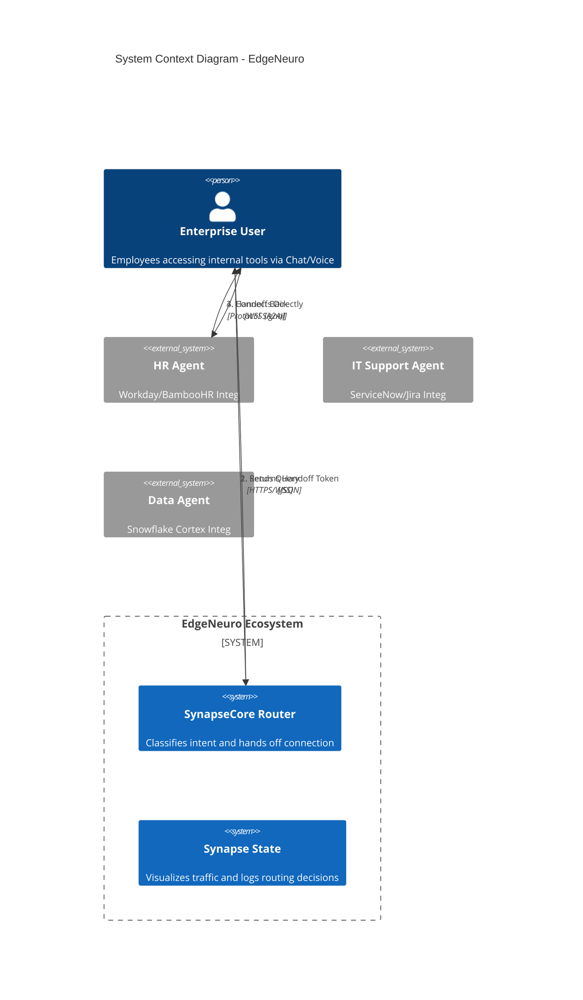
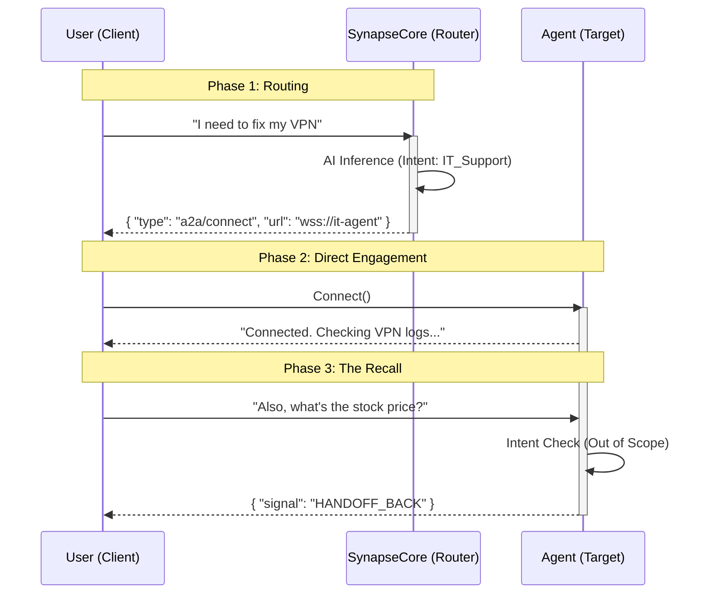

# EdgeNeuro 🧠

**Enterprise-Grade Serverless Intent Detection Router**

EdgeNeuro is a "Hot Potato" architecture orchestrator built on Cloudflare Workers (SynapseCore), Workers AI (Llama-3), and Durable Objects. It acts as an **Edge Router**, classifying user intent in <50ms and handing off connections directly to specialized agents.

---

## Architecture Diagrams

### System Context

EdgeNeuro acts as the intelligent routing layer (middleware) between Enterprise Users and the distributed Agent Mesh.

### The "Hot Potato" Handoff Protocol

The Router does NOT proxy traffic; it introduces and leaves. This ensures zero bottleneck and infinite scalability.

---

## Key Concepts (Validated 2026)

This architecture is based on the latest research in multi-agent orchestration:

1.  **SLMs for Intent Detection:** Using Small Language Models (like Llama-3-8B) at the edge for routing is a validated pattern for achieving <100ms latency. [Reference](https://arxiv.org/abs/2601.17156)
2.  **A2A Protocol:** We implement the Agent-to-Agent standard for interoperability.
3.  **Ephemeral/Stateless Routers:** By keeping the orchestrator stateless, we support infinite scaling and eliminate single points of failure.

---

## Comparison with Other Orchestrators

| Feature | EdgeNeuro | Microsoft Copilot | IBM Watsonx Orchestrate | AutoGen |
|---------|-----------|-------------------|------------------------|---------|
| **Deployment** | Edge (Cloudflare Workers) | Centralized Cloud | Centralized Cloud | Self-hosted |
| **Architecture** | Stateless "Hot Potato" | Stateful Proxy | Stateful Proxy | Stateful Proxy |
| **Intent Detection** | Fine-tuned SLM (<50ms) | Generic LLM | Generic LLM | Custom LLM |
| **Protocols** | A2A + MCP | Proprietary | Proprietary | MCP (partial) |
| **Scaling** | Infinite (ephemeral) | Limited by cloud | Limited by cloud | Limited by infra |
| **Source** | Open Source | Proprietary | Proprietary | Open Source |
| **Cost** | Pay-per-request | Enterprise license | Enterprise license | Infrastructure |

**Key Differentiators:**
- **Edge-First:** Runs on Cloudflare's global network, closest to users.
- **Hot Potato Pattern:** Router introduces client to agent and leaves; no proxy bottleneck.
- **Standards-Based:** Built on A2A and MCP for interoperability.
- **Fine-tuned SLM:** Uses small models optimized for routing intent, not general conversation.

---

## Spec-Driven Development

This project follows **GitHub Spec Kit**. See `.spec/` for immutable rules and technical specifications.

## Setup

1.  **Install Deps:** `npm install`
2.  **Deploy SynapseCore:** `cd synapse_core && wrangler deploy`
3.  **Run Viz:** `cd viz && npm run dev`

## License

MIT
