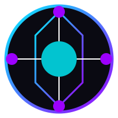
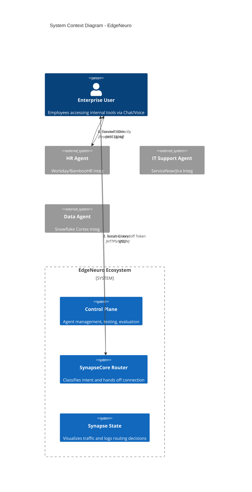
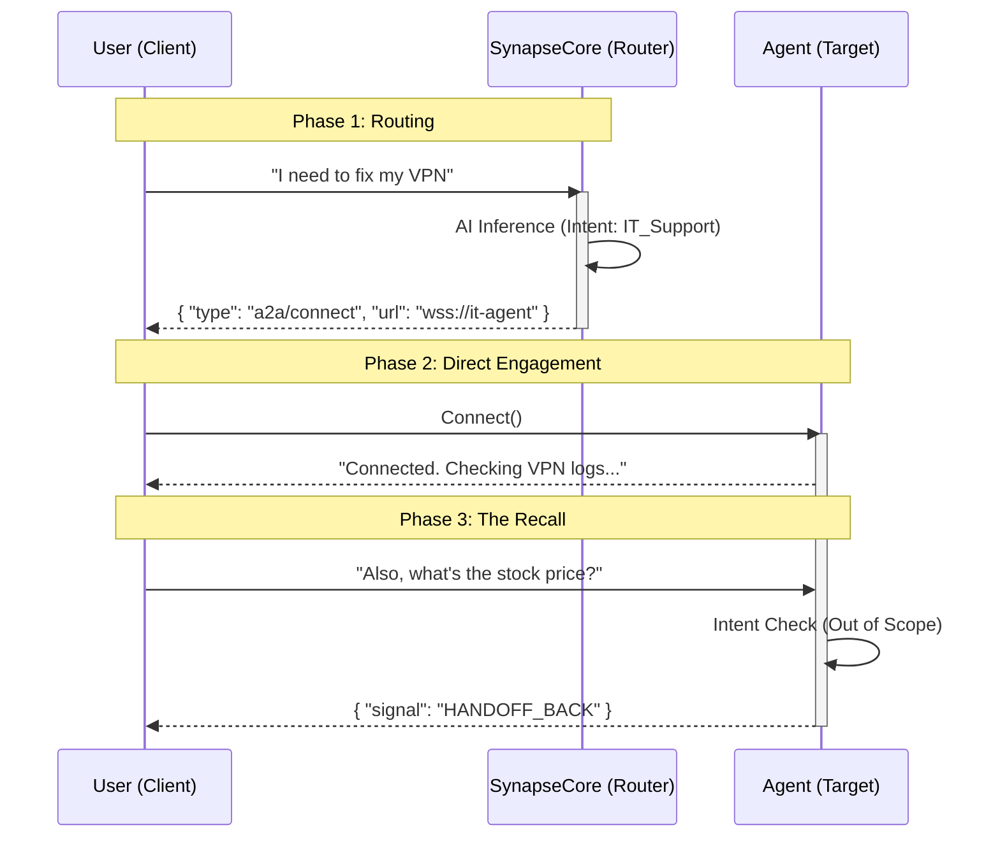
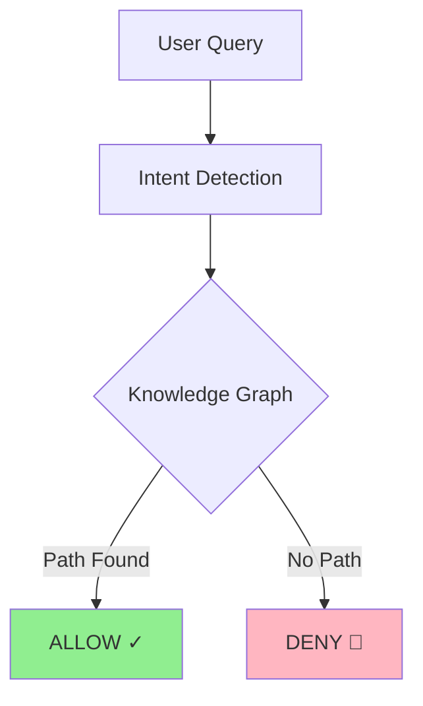
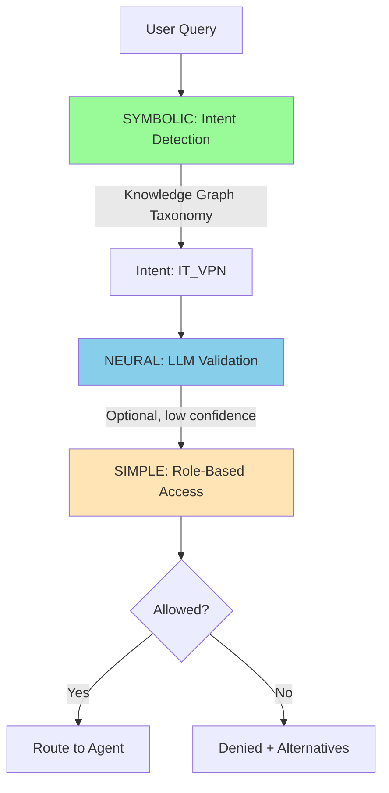
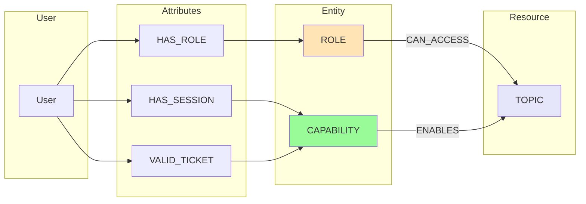

# EdgeNeuro 🧠⚙️🎼

**Enterprise-Grade Serverless Router & Orchestrator**



> "The future is per-request ephemeral supervisors that spin up, route, and die. It's efficient." — *EdgeNeuro Philosophy*

---

## What is EdgeNeuro? 🚦🎼

**EdgeNeuro is both a Router AND an Orchestrator** using a "Hot Potato" pattern:

| As a **Router** 🚦 | As an **Orchestrator** 🎼 |
|-------------------|------------------------|
| Classifies user intent in **<50ms** | Coordinates a **mesh of specialized agents** |
| Dispatches to the correct agent | Connects user to agent and **exits immediately** |
| Uses **Neuro-Symbolic** intent detection | No bottleneck - zero state |

### The Hot Potato Pattern 🎯

```
1. User query → EdgeNeuro
2. Neuro-Symbolic Intent Detection (<50ms)
3. EdgeNeuro connects user to agent
4. EdgeNeuro EXITS - no proxy, no bottleneck
5. User ↔ Agent (direct connection)
```

### Neuro-Symbolic Approach 🧠⚙️

Combines the "intuition" of Language Models with the "logic" of a Knowledge Graph:

- **Symbolic**: Knowledge Graph taxonomy for intent (explicit, auditable)
- **Neural**: LLM validates intent only when confidence is low
- **Result**: Secure, precise, explainable routing

---

## Architecture Diagrams

### System Context

EdgeNeuro acts as the intelligent routing layer (middleware) between Enterprise Users and the distributed Agent Mesh.



### The "Hot Potato" Handoff Protocol

The Router does NOT proxy traffic; it introduces and leaves. This ensures zero bottleneck and infinite scalability.



---

## Components

| Component | Description | Deployment |
|-----------|-------------|------------|
| **SynapseCore** | Router with intent detection, agent registry, MCP/A2A support | Cloudflare Workers |
| **Control Plane** | Web UI for agent management, testing, evaluation | Cloudflare Pages |
| **Test Agents** | Sample HR and IT agents for POC | Cloudflare Workers |

---

## 🧠 Neuro-Symbolic Architecture

EdgeNeuro implements a **Neuro-Symbolic** approach to access control, combining the best of neural networks and symbolic AI.

### The Principle: Default Deny (Privilege Minimal)



**Why Default Deny?**
- **Security:** If the LLM makes an error, access is blocked (not opened)
- **Predictable:** Every decision is traceable and auditable
- **No Ambiguity:** No "maybe" - explicit allow or deny

### Neuro-Symbolic: The Correct Architecture



| Layer | Component | Purpose |
|-------|-----------|---------|
| **Symbolic** | Knowledge Graph Intent Taxonomy | Detect intent using explicit rules |
| **Neural** | LLM (Llama-3) | Validate/confirm intent (optional) |
| **Simple** | Role-Based Access Control | Check if role can access category |

### How It Works

1. **User Query** → Sent to SynapseCore
2. **SYMBOLIC** → Knowledge Graph matches keywords → Intent (e.g., "IT_VPN")
3. **NEURAL** → LLM validates intent (only if confidence < 90%)
4. **SIMPLE** → Role-based category access check
5. **Decision** → Route to agent OR Deny with alternatives

### 🕸️ Knowledge Graph (Symbolic Intent Taxonomy)



**Knowledge Graph Features:**
- **Node Types:** USER, ROLE, **CAPABILITY**, GROUP, TOPIC, AGENT, RULE
- **Edge Types:** HAS_ROLE, **HAS_SESSION**, **VALID_TICKET**, CAN_ACCESS, MEMBER_OF, ROUTES_TO
- **Capability-Based:** Dynamic permissions (e.g., HAS_ACTIVE_SESSION, VALID_TICKET)
- **Queryable:** Find all paths from user to topic
- **Explainable:** Every decision includes the reasoning path
- **Dynamic:** Can update permissions without code changes

### Capability-Based Access Control

Instead of fixed roles, EdgeNeuro uses **dynamic capabilities**:

```typescript
// User can have capabilities beyond their role
const userCapabilities = [
  'HAS_ACTIVE_SESSION',    // User is logged in
  'VALID_TICKET',          // User has open IT ticket
  'MANAGER_APPROVED',     // Manager approved access
  'SECURITY_CLEARED'      // Passed security check
];
```

**Example Path with Capabilities:**
```
USER → HAS_SESSION → EMPLOYEE → CAN_ACCESS → IT_TICKETS
USER → VALID_TICKET → CAN_ACCESS → IT_HARDWARE
```

This makes access control **truly scalable** and **agnostic** - capabilities can be granted/removed dynamically without changing roles.

### Security Model

| Concept | Implementation |
|---------|----------------|
| **Policy** | Explicit role → topic mappings in `symbolic-engine.ts` |
| **Resolution** | Topic aliases (e.g., "vacation" → "BENEFITS") |
| **Denial** | Returns alternatives user CAN access |
| **Audit** | Every decision logged with auditId |

### Example Access Policy

```typescript
const ACCESS_POLICY = {
  'PAYROLL': ['HR_ADMIN', 'FINANCE', 'CEO'],
  'BENEFITS': ['HR_ADMIN', 'HR_MANAGER', 'CEO'],
  'IT_TICKETS': ['ALL'],  // Anyone can access
  'SALES_REPORTS': ['SALES', 'MARKETING', 'CEO'],
  'HR_POLICIES': ['ALL'],  // Public
  'ADMIN_PANEL': ['ADMIN']
};
```

### API Endpoints (Symbolic)

| Endpoint | Method | Description |
|----------|--------|-------------|
| `/v1/symbolic/intent` | GET | **Neuro-Symbolic Intent Detection** (NEW!) |
| `/v1/symbolic/policy` | GET | Get access policy + Knowledge Graph stats |
| `/v1/symbolic/graph` | GET | Query Knowledge Graph directly |
| `/v1/symbolic/evaluate` | POST | Evaluate single access request |
| `/v1/symbolic/route` | GET | Full neuro-symbolic routing |

### Example: Neuro-Symbolic Intent Detection

```
GET /v1/symbolic/intent?q=my%20vpn%20is%20not%20working&role=EMPLOYEE
```

```json
{
  "architecture": {
    "description": "Neuro-Symbolic Intent Detection + Simple Access Control",
    "step1_symbolic": {
      "component": "Knowledge Graph Intent Taxonomy",
      "intents": 21,
      "output": {
        "intent": "IT_VPN",
        "category": "IT",
        "confidence": 0.95,
        "reasoning": "Symbolic resolution: keyword_match"
      }
    },
    "step2_neural": "skipped (high confidence)",
    "step3_simple_access": {
      "userRole": "EMPLOYEE",
      "category": "IT",
      "canAccess": true
    }
  },
  "query": "my vpn is not working",
  "intent": "IT_VPN",
  "confidence": 0.95,
  "category": "IT",
  "allowed": true
}
```

### Example: Query Knowledge Graph

```
GET /v1/symbolic/graph?role=MARKETING
```

```json
{
  "query": "accessible_topics",
  "role": "MARKETING",
  "accessible_topics": [
    { "topic": "SALES_REPORTS", "access_level": "READ", "path": "MARKETING → SALES_REPORTS" },
    { "topic": "MARKETING_CAMPAIGNS", "access_level": "READ", "path": "MARKETING → MARKETING_CAMPAIGNS" },
    { "topic": "IT_TICKETS", "access_level": "READ", "path": "EMPLOYEE → IT_TICKETS" }
  ]
}
```

### Example: Check Specific Access

```
GET /v1/symbolic/graph?role=MARKETING&topic=PAYROLL
```

```json
{
  "query": "access_check",
  "role": "MARKETING",
  "topic": "PAYROLL",
  "has_access": false,
  "explanation": "Role MARKETING does NOT have access to PAYROLL. No path found in knowledge graph.",
  "paths": []
}
```

### Example Request/Response

**Request:**
```
GET /v1/symbolic/route?q=show%20payroll%20data&role=MARKETING
```

**Response:**
```json
{
  "architecture": {
    "neural": {
      "component": "LLM Intent Detection",
      "output": { "topic": "PAYROLL", "confidence": 0.95 }
    },
    "symbolic": {
      "component": "Symbolic Access Engine", 
      "principle": "DEFAULT_DENY",
      "output": { "decision": "DENY", "reason": "Role MARKETING not in allowed roles for PAYROLL" }
    }
  },
  "allowed": false,
  "alternatives": ["SALES_REPORTS", "HR_POLICIES", "IT_TICKETS"],
  "suggestions": [
    "Your role (MARKETING) does not have access to PAYROLL",
    "You can access: SALES_REPORTS, HR_POLICIES, IT_TICKETS",
    "Contact your manager to request access"
  ]
}
```

---

## API Endpoints

| Endpoint | Method | Description |
|----------|--------|-------------|
| `/health` | GET | Health check |
| `/v1/agents` | GET | List registered agents |
| `/v1/agent/register` | POST | Register new agent (protected) |
| `/v1/agent/approve` | POST | Approve agent for routing |
| `/v1/discover` | GET | Probe MCP endpoint capabilities |
| `/v1/test` | GET | Test routing with query |
| `/?q=` | GET | Route query to agent |

---

## Key Concepts (Validated 2026)

This architecture is based on the latest research in multi-agent orchestration:

1.  **Neuro-Symbolic Intent Detection:** Using Knowledge Graph taxonomy for explicit, auditable intent classification. LLM is only used for optional validation, not primary detection.
2.  **A2A Protocol:** We implement the Agent-to-Agent standard for interoperability.
3.  **Ephemeral/Stateless Routers:** By keeping the orchestrator stateless, we support infinite scaling and eliminate single points of failure.

---

## Comparison with Other Orchestrators

| Feature | EdgeNeuro | Microsoft Copilot Studio | IBM Watsonx Orchestrate | AutoGen |
|---------|-----------|-------------------------|------------------------|---------|
| **Deployment** | Edge (Cloudflare Workers) | Centralized Cloud | Centralized Cloud | Self-hosted |
| **Architecture** | Stateless "Hot Potato" | Stateful Proxy | Stateful Proxy | Stateful Proxy |
| **Intent Detection** | **Knowledge Graph Taxonomy** | Generic LLM | Generic LLM | Custom LLM |
| **Access Control** | **Neuro-Symbolic + KG** | Role-based | Role-based | Basic |
| **Security Model** | **Default Deny + Capabilities** | Allow by default | Allow by default | Basic |
| **Protocols** | A2A + MCP | MCP (since 2025) | Proprietary | MCP (partial) |
| **Scaling** | Infinite (ephemeral) | Limited by cloud | Limited by cloud | Limited by infra |
| **Source** | Open Source | Proprietary | Proprietary | Open Source |
| **Cost** | Pay-per-request | Enterprise license | Enterprise license | Infrastructure |

**Key Differentiators:**
- **Router + Orchestrator:** Acts as both - classifies intent AND coordinates agent mesh
- **Hot Potato Pattern:** Connects user to agent and exits immediately - no bottleneck
- **Neuro-Symbolic Intent Detection:** Knowledge Graph taxonomy + optional LLM validation
- **Default Deny:** Most secure - if no explicit permission, access is blocked
- **Capability-Based:** Dynamic permissions (e.g., HAS_VALID_TICKET, MANAGER_APPROVED)
- **Explainable:** Every decision includes reasoning path from Knowledge Graph
- **Edge-First:** Runs on Cloudflare's global network, closest to users
- **Standards-Based:** Built on A2A and MCP for interoperability

---

## Spec-Driven Development

This project follows **GitHub Spec Kit**. See `.spec/` for immutable rules and technical specifications.

## Setup

```bash
# Clone and install
npm install

# Deploy SynapseCore (Router)
cd synapse_core
wrangler deploy

# Deploy Control Plane (Web UI)
cd ../controlplane
npm install
npm run deploy
```

## Control Plane Features

- **Login** - Username/password authentication
- **Dashboard** - Health status, orchestrator metrics
- **Agents** - Register, approve, discover MCP capabilities
- **Testing** - A2A and MCP protocol testing
- **Evaluation** - Latency and accuracy metrics

### Demo Accounts

| Username | Password | Role |
|----------|----------|------|
| admin | admin123 | Full access |
| eduardo | edu123 | Operator |
| operator | operator123 | Read-only |

## License

MIT — Eduardo Arana 2026
