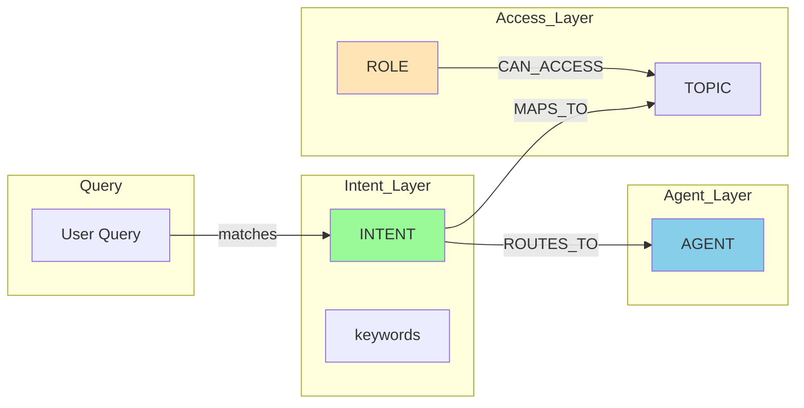

# EdgeNeuro 🧠⚙️🎼

An Agent Orchestration and Router with Intent Detection using LLM and Neuro Symbolic approach.

**Developer:** Eduardo Arana  
**Assistant:** Soda 🥤


> "The future is per-request ephemeral supervisors that spin up, route, and die. It's efficient." — *EdgeNeuro Philosophy*

---

## What is EdgeNeuro? 🚦🎼

**EdgeNeuro is both a Router AND an Orchestrator** using a "Hot Potato" pattern:

| As a **Router** 🚦 | As an **Orchestrator** 🎼 |
|-------------------|------------------------|
| Classifies user intent in **<50ms** | Coordinates a **mesh of specialized agents** |
| Dispatches to the correct agent | Connects user to agent and **exits immediately** |
| Uses **Neuro-Symbolic** intent detection | No bottleneck - zero state |

### The Hot Potato Pattern 🎯

```
1. User query → EdgeNeuro
2. Neuro-Symbolic Intent Detection (<50ms)
3. EdgeNeuro connects user to agent
4. EdgeNeuro EXITS - no proxy, no bottleneck
5. User ↔ Agent (direct connection)
```

### Neuro-Symbolic Approach

Combines the "intuition" of Language Models with the "logic" of a Knowledge Graph:

- **Symbolic**: Knowledge Graph taxonomy for intent (explicit, auditable)
- **Neural**: LLM validates intent only when confidence is low
- **Result**: Secure, precise, explainable routing

---

## The 3 Capital Sins of Traditional Orchestration

EdgeNeuro solves the three critical failures of traditional agent orchestration:

### 1. Latency

Traditional orchestrators act as persistent proxies that must:
- Process every message through the orchestration layer
- Maintain conversation state for each user
- Route messages sequentially through middleware

**EdgeNeuro Solution**: Routing happens in **<50ms** at the edge, closest to the user. The router performs intent classification and immediately hands off, then exits. No state to maintain, no queuing.

### 2. Security (Hallucinations)

Most orchestrators blindly trust the LLM to make routing decisions. This creates:
- Prompt injection attacks that can redirect traffic
- Hallucinated permissions that grant unauthorized access
- No audit trail for access decisions

**EdgeNeuro Solution**: **Neuro-Symbolic Architecture**. The Knowledge Graph is the source of truth - if no explicit path exists in the graph, access is physically blocked. LLM is only used for optional disambiguation, never for access control.

### 3. Bottlenecks

Centralized orchestrators create:
- Single points of failure
- Resource exhaustion under load
- Latency that scales with user count

**EdgeNeuro Solution**: **Hot Potato Pattern**. The router introduces user to agent and immediately exits. No proxy, no state, no bottleneck. Scale is unlimited because each request is independent.

| Problem | Traditional | EdgeNeuro |
|---------|-------------|-----------|
| Latency | Seconds per request | <50ms |
| Security | LLM trust | Knowledge Graph (Default Deny) |
| Bottlenecks | Central proxy | Ephemeral (no state) |

---

## Architecture Diagrams

### System Context

EdgeNeuro acts as the intelligent routing layer (middleware) between Enterprise Users and the distributed Agent Mesh.


### The "Hot Potato" Handoff Protocol

The Router does NOT proxy traffic; it introduces and leaves. This ensures zero bottleneck and infinite scalability.


---

## Components

| Component | Description | Deployment |
|-----------|-------------|------------|
| **SynapseCore** | Router with intent detection, agent registry, MCP/A2A support | Cloudflare Workers |
| **Control Plane** | Web UI for agent management, testing, evaluation | Cloudflare Pages |
| **Test Agents** | Sample HR and IT agents for POC | Cloudflare Workers |

---

## 🧠 Neuro-Symbolic Architecture

EdgeNeuro implements a **Neuro-Symbolic** approach to access control, combining the best of neural networks and symbolic AI.

### The Principle: Default Deny (Privilege Minimal)

```mermaid
flowchart TD
    A[User Query] --> B[Intent Detection]
    B --> C{Knowledge Graph}
    C -->|Path Found| D[ALLOW ✓]
    C -->|No Path| E[DENY 🚫]
    
    style D fill:#90EE90
    style E fill:#FFB6C1
```



**Why Default Deny?**
- **Security:** If the LLM makes an error, access is blocked (not opened)
- **Predictable:** Every decision is traceable and auditable
- **No Ambiguity:** No "maybe" - explicit allow or deny

### Neuro-Symbolic: The TRUE Architecture

```mermaid
flowchart TD
    Q[User Query] --> S1[SYMBOLIC: KG Intent Detection]
    S1 -->|Find matching intents| I{Intent Found?}
    I -->|Yes, confidence > 0.5| S2[SYMBOLIC: KG Access Control]
    I -->|No, confidence < 0.5| N[NEURAL: LLM Validation]
    N --> S2
    S2 -->|Check role → topic| D{Access ALLOW?}
    D -->|ALLOW| R[Route to Agent]
    D -->|DENY| E[403 Denied + Alternatives]
    
    style S1 fill:#98FB98
    style S2 fill:#98FB98
    style N fill:#87CEEB
    style D fill:#FFE4B5
```



**TRUE Neuro-Symbolic Flow:**
1. **SYMBOLIC (Primary)**: Knowledge Graph finds intent by keywords → returns topic + confidence
2. **NEURAL (Fallback)**: LLM validates intent only if KG confidence < 0.5
3. **SYMBOLIC (Access)**: Knowledge Graph evaluates role → topic permissions (DEFAULT DENY)
4. **ROUTE** only if access ALLOWED

| Layer | Component | Purpose | When |
|-------|-----------|---------|-------|
| **Symbolic** | KG Intent Detection | Find intent by keywords | ALWAYS (primary) |
| **Neural** | LLM (Llama-3) | Validate intent | Only if KG confidence < 0.5 |
| **Symbolic** | KG Access Control | Default Deny policy | ALWAYS |

### How It Works (TRUE Neuro-Symbolic)

1. **User Query** → Sent to SynapseCore
2. **SYMBOLIC** → KG finds intent by keywords (e.g., "vpn" → IT_VPN, confidence 0.9)
3. **NEURAL** → LLM validates ONLY if KG confidence < 0.5
4. **SYMBOLIC** → KG evaluates role → topic access (DEFAULT DENY)
5. **Decision** → Route to agent if ALLOW, 403 + alternatives if DENY

### 🕸️ Knowledge Graph (Symbolic Intent + Access)



**Node Types:**
- **INTENT** - Intent definitions with keywords (e.g., "vpn" → IT_VPN)
- **ROLE** - User roles (EMPLOYEE, IT_ADMIN, HR_ADMIN, etc.)
- **TOPIC** - Resources (IT_TICKETS, PAYROLL, BENEFITS, etc.)
- **AGENT** - Target agents (agent_it, agent_hr, etc.)

**Edge Types:**
- INTENT → TOPIC (MAPS_TO)
- INTENT → AGENT (ROUTES_TO)
- ROLE → TOPIC (CAN_ACCESS)

**Knowledge Graph Features:**
- **Node Types:** USER, ROLE, **CAPABILITY**, GROUP, TOPIC, AGENT, RULE
- **Edge Types:** HAS_ROLE, **HAS_SESSION**, **VALID_TICKET**, CAN_ACCESS, MEMBER_OF, ROUTES_TO
- **Capability-Based:** Dynamic permissions (e.g., HAS_ACTIVE_SESSION, VALID_TICKET)
- **Queryable:** Find all paths from user to topic
- **Explainable:** Every decision includes the reasoning path
- **Dynamic:** Can update permissions without code changes

### Capability-Based Access Control

Instead of fixed roles, EdgeNeuro uses **dynamic capabilities**:

```typescript
// User can have capabilities beyond their role
const userCapabilities = [
  'HAS_ACTIVE_SESSION',    // User is logged in
  'VALID_TICKET',          // User has open IT ticket
  'MANAGER_APPROVED',     // Manager approved access
  'SECURITY_CLEARED'      // Passed security check
];
```

**Example Path with Capabilities:**
```
USER → HAS_SESSION → EMPLOYEE → CAN_ACCESS → IT_TICKETS
USER → VALID_TICKET → CAN_ACCESS → IT_HARDWARE
```

This makes access control **truly scalable** and **agnostic** - capabilities can be granted/removed dynamically without changing roles.

### Security Model

| Concept | Implementation |
|---------|----------------|
| **Policy** | Explicit role → topic mappings in `symbolic-engine.ts` |
| **Resolution** | Topic aliases (e.g., "vacation" → "BENEFITS") |
| **Denial** | Returns alternatives user CAN access |
| **Audit** | Every decision logged with auditId |

### Example Access Policy

```typescript
const ACCESS_POLICY = {
  'PAYROLL': ['HR_ADMIN', 'FINANCE', 'CEO'],
  'BENEFITS': ['HR_ADMIN', 'HR_MANAGER', 'CEO'],
  'IT_TICKETS': ['ALL'],  // Anyone can access
  'SALES_REPORTS': ['SALES', 'MARKETING', 'CEO'],
  'HR_POLICIES': ['ALL'],  // Public
  'ADMIN_PANEL': ['ADMIN']
};
```

### API Endpoints (Symbolic)

| Endpoint | Method | Description |
|----------|--------|-------------|
| `/v1/symbolic/intent` | GET | **Neuro-Symbolic Intent Detection** (NEW!) |
| `/v1/symbolic/policy` | GET | Get access policy + Knowledge Graph stats |
| `/v1/symbolic/graph` | GET | Query Knowledge Graph directly |
| `/v1/symbolic/evaluate` | POST | Evaluate single access request |
| `/v1/symbolic/route` | GET | Full neuro-symbolic routing |

### Example: Neuro-Symbolic Intent Detection

```
GET /v1/symbolic/intent?q=my%20vpn%20is%20not%20working&role=EMPLOYEE
```

```json
{
  "architecture": {
    "description": "Neuro-Symbolic Intent Detection + Simple Access Control",
    "step1_symbolic": {
      "component": "Knowledge Graph Intent Taxonomy",
      "intents": 21,
      "output": {
        "intent": "IT_VPN",
        "category": "IT",
        "confidence": 0.95,
        "reasoning": "Symbolic resolution: keyword_match"
      }
    },
    "step2_neural": "skipped (high confidence)",
    "step3_simple_access": {
      "userRole": "EMPLOYEE",
      "category": "IT",
      "canAccess": true
    }
  },
  "query": "my vpn is not working",
  "intent": "IT_VPN",
  "confidence": 0.95,
  "category": "IT",
  "allowed": true
}
```

### Example: Query Knowledge Graph

```
GET /v1/symbolic/graph?role=MARKETING
```

```json
{
  "query": "accessible_topics",
  "role": "MARKETING",
  "accessible_topics": [
    { "topic": "SALES_REPORTS", "access_level": "READ", "path": "MARKETING → SALES_REPORTS" },
    { "topic": "MARKETING_CAMPAIGNS", "access_level": "READ", "path": "MARKETING → MARKETING_CAMPAIGNS" },
    { "topic": "IT_TICKETS", "access_level": "READ", "path": "EMPLOYEE → IT_TICKETS" }
  ]
}
```

### Example: Check Specific Access

```
GET /v1/symbolic/graph?role=MARKETING&topic=PAYROLL
```

```json
{
  "query": "access_check",
  "role": "MARKETING",
  "topic": "PAYROLL",
  "has_access": false,
  "explanation": "Role MARKETING does NOT have access to PAYROLL. No path found in knowledge graph.",
  "paths": []
}
```

### Example Request/Response

**Request:**
```
GET /v1/symbolic/route?q=show%20payroll%20data&role=MARKETING
```

**Response:**
```json
{
  "architecture": {
    "neural": {
      "component": "LLM Intent Detection",
      "output": { "topic": "PAYROLL", "confidence": 0.95 }
    },
    "symbolic": {
      "component": "Symbolic Access Engine", 
      "principle": "DEFAULT_DENY",
      "output": { "decision": "DENY", "reason": "Role MARKETING not in allowed roles for PAYROLL" }
    }
  },
  "allowed": false,
  "alternatives": ["SALES_REPORTS", "HR_POLICIES", "IT_TICKETS"],
  "suggestions": [
    "Your role (MARKETING) does not have access to PAYROLL",
    "You can access: SALES_REPORTS, HR_POLICIES, IT_TICKETS",
    "Contact your manager to request access"
  ]
}
```

---

## API Endpoints

| Endpoint | Method | Description |
|----------|--------|-------------|
| `/health` | GET | Health check |
| `/v1/agents` | GET | List registered agents |
| `/v1/agent/register` | POST | Register new agent (protected) |
| `/v1/agent/approve` | POST | Approve agent for routing |
| `/v1/discover` | GET | Probe MCP endpoint capabilities |
| `/v1/test` | GET | Test routing with query |
| `/?q=` | GET | Route query to agent |

---

## Key Concepts (Validated 2026)

This architecture is based on the latest research in multi-agent orchestration:

1.  **Neuro-Symbolic Intent Detection:** Using Knowledge Graph taxonomy for explicit, auditable intent classification. LLM is only used for optional validation, not primary detection.
2.  **A2A Protocol:** We implement the Agent-to-Agent standard for interoperability.
3.  **Ephemeral/Stateless Routers:** By keeping the orchestrator stateless, we support infinite scaling and eliminate single points of failure.

---

## Comparison with Other Orchestrators

| Feature | EdgeNeuro | Microsoft Copilot Studio | IBM Watsonx Orchestrate | AutoGen |
|---------|-----------|-------------------------|------------------------|---------|
| **Deployment** | Edge (Cloudflare Workers) | Centralized Cloud | Centralized Cloud | Self-hosted |
| **Architecture** | Stateless "Hot Potato" | Stateful Proxy | Stateful Proxy | Stateful Proxy |
| **Intent Detection** | **Knowledge Graph Taxonomy** | Generic LLM | Generic LLM | Custom LLM |
| **Access Control** | **Neuro-Symbolic + KG** | Role-based | Role-based | Basic |
| **Security Model** | **Default Deny + Capabilities** | Allow by default | Allow by default | Basic |
| **Protocols** | A2A + MCP | MCP (since 2025) | Proprietary | MCP (partial) |
| **Scaling** | Infinite (ephemeral) | Limited by cloud | Limited by cloud | Limited by infra |
| **Source** | Open Source | Proprietary | Proprietary | Open Source |
| **Cost** | Pay-per-request | Enterprise license | Enterprise license | Infrastructure |

**Key Differentiators:**
- **Router + Orchestrator:** Acts as both - classifies intent AND coordinates agent mesh
- **Hot Potato Pattern:** Connects user to agent and exits immediately - no bottleneck
- **Neuro-Symbolic Intent Detection:** Knowledge Graph taxonomy + optional LLM validation
- **Default Deny:** Most secure - if no explicit permission, access is blocked
- **Capability-Based:** Dynamic permissions (e.g., HAS_VALID_TICKET, MANAGER_APPROVED)
- **Explainable:** Every decision includes reasoning path from Knowledge Graph
- **Edge-First:** Runs on Cloudflare's global network, closest to users
- **Standards-Based:** Built on A2A and MCP for interoperability

---

## Spec-Driven Development

This project follows **GitHub Spec Kit**. See `.spec/` for immutable rules and technical specifications.

## Setup

```bash
# Clone and install
npm install

# Deploy SynapseCore (Router)
cd synapse_core
wrangler deploy

# Deploy Control Plane (Web UI)
cd ../controlplane
npm install
npm run deploy
```

## Control Plane Features

- **Login** - Username/password authentication
- **Dashboard** - Health status, orchestrator metrics
- **Agents** - Register, approve, discover MCP capabilities
- **Testing** - A2A and MCP protocol testing
- **Evaluation** - Latency and accuracy metrics

### Demo Accounts

| Username | Password | Role |
|----------|----------|------|
| admin | admin123 | Full access |
| eduardo | edu123 | Operator |
| operator | operator123 | Read-only |

## License

MIT — Eduardo Arana 2026
