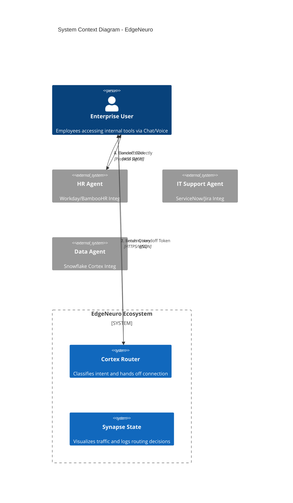
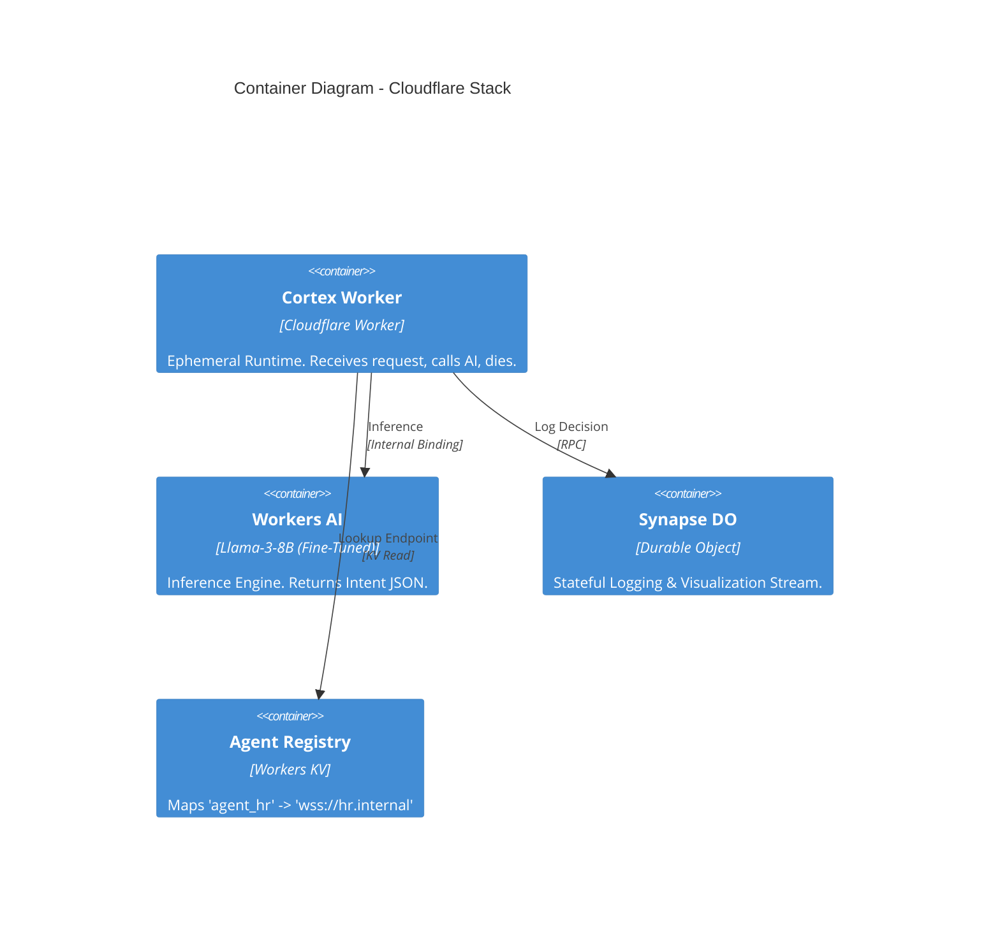
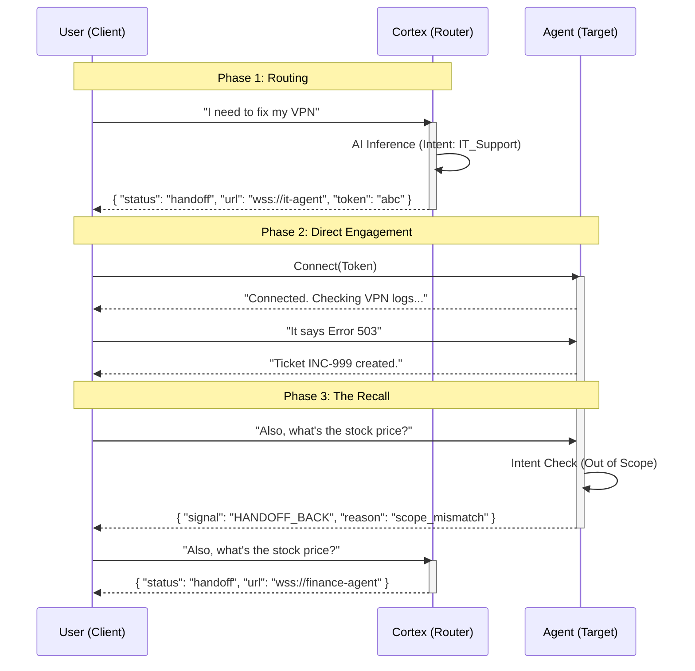

# EdgeNeuro Architecture 🧠

**Status:** Approved
**Architect:** Eduardo Arana
**Version:** 1.0

## 1. System Context (C4 Level 1)

EdgeNeuro acts as the intelligent routing layer (middleware) between Enterprise Users and the distributed Agent Mesh.

## 2. Container Architecture (C4 Level 2)

Leveraging Cloudflare's Serverless Edge for <50ms latency.

## 3. The "Hot Potato" Handoff Protocol (Sequence)

This is the core efficiency pattern. The Router does NOT proxy traffic; it introduces and leaves.

